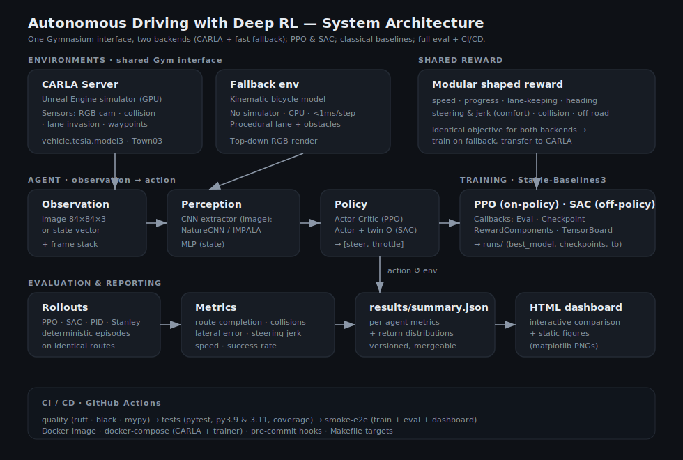
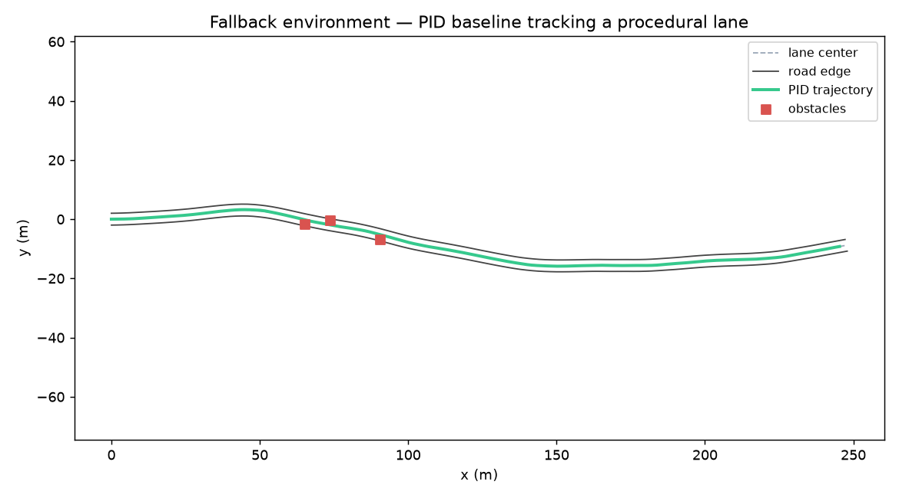
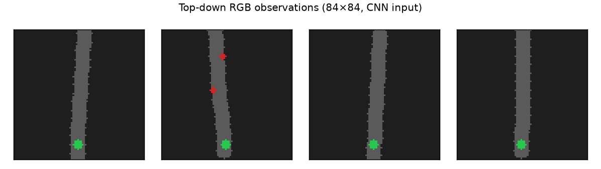
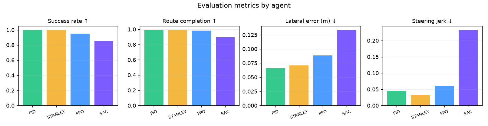

# 🚗 Autonomous Driving with Deep Reinforcement Learning

Train **PPO** and **SAC** agents to drive in the **CARLA** simulator — and on a fast,
dependency-free **fallback environment** that shares the *exact same* Gymnasium
interface. The project ships perception (CNN policies), classical control
baselines (PID + Stanley), a modular shaped reward, a full evaluation suite with
an interactive dashboard, Docker, and a real GitHub Actions CI/CD pipeline.

<!-- Update the repo slug below once you push to GitHub -->
[](https://github.com/aimee-wagner/autonomous-driving-rl/actions/workflows/ci.yml)


<p align="center">
  
</p>

---

## Why this project is built the way it is

CARLA is a multi-gigabyte, GPU-bound Unreal Engine simulator. That makes it
wonderful for realism and terrible for fast iteration, unit tests, and CI. The
core design decision here is a **single Gymnasium interface with two backends**:

| | **CARLA backend** | **Fallback backend** |
|---|---|---|
| Fidelity | Full simulator, sensors, traffic | Kinematic bicycle model |
| Speed | Real-time, GPU | < 1 ms/step, CPU |
| Use | Final training & demos | Dev, tests, CI, reward tuning |
| Observation | RGB camera / state | Top-down RGB render / state |
| Reward | **identical** | **identical** |

Because the reward, observation, and action spaces are identical, a policy
developed against the fallback runs **unchanged** on CARLA, and the entire
pipeline — env → perception → agent → training → evaluation → dashboard — is
validated end-to-end in CI without ever launching the simulator.

---

## Quickstart

```bash
# 1. Install (CPU is fine for the fallback env; add CUDA PyTorch for CARLA)
python -m venv .venv && source .venv/bin/activate
pip install -e ".[dev,viz]"

# 2. Fast end-to-end smoke run on the simulator-free env (~30s on a laptop)
make smoke

# 3. Evaluate the classical baselines and build the dashboard
python -m ad_rl.evaluation.evaluate --model pid     --env fallback --obs state --episodes 20
python -m ad_rl.evaluation.evaluate --model stanley --env fallback --obs state --episodes 20
make dashboard            # -> dashboard/index.html
python scripts/make_figures.py   # -> docs/images/*.png
```

No GPU and no CARLA download required for any of the above.

---

## The environment

A procedurally generated, curvy single lane with avoidable obstacles. The agent
must keep its lane, hold a target speed (30 km/h), and avoid collisions. Below:
the tuned **PID baseline** tracking a generated route, and the **top-down RGB
frames** the CNN policy actually consumes.

<p align="center">
  
  
</p>

---

## Algorithms

**Learned (Stable-Baselines3):**

- **PPO** — on-policy, stable, the workhorse of driving RL. Recent work
  (*CaRL*, 2025) scales PPO to 300M CARLA samples and tops route-completion
  benchmarks with simple, well-shaped rewards. This is the project's primary algorithm.
- **SAC** — off-policy, maximum-entropy, sample-efficient continuous control.
  Included as a head-to-head comparison on the identical task.

**Perception** — a configurable CNN feature extractor for image observations:
NatureCNN (default) or a deeper residual **IMPALA** net, both wired into SB3
policies. State observations use an MLP.

**Classical baselines (non-learning):**

- **PID** — longitudinal speed PID + lateral cross-track/heading PID.
- **Stanley** — the DARPA Grand Challenge steering law, speed-damped.

Baselines matter: if a learned policy can't match a tuned controller on the same
route, that's a signal — and the controller is what the RL agent must beat *from
pixels alone*, where the controller's privileged state isn't available.

---

## Reward

One modular, fully-logged reward (`src/ad_rl/rewards/reward.py`), shared by both
backends so the optimisation target never drifts between them:

```
r = w_speed·speed + w_progress·progress − w_lane·lane² − w_heading·|heading|
      − w_steer·steer² − w_jerk·Δsteer²        (− collision / off-road, terminal)
```

Every term is returned separately and logged to TensorBoard — reward shaping is
where most driving-RL projects quietly fail, so it's made observable.

---

## Results

Metrics over 20 deterministic evaluation episodes on identical routes — **all four
agents are real measurements** from a 100k-step run on the surrogate environment
(PPO and SAC trained from scratch). Reproduce with `.\run.ps1` (Windows) or the
`make` targets.

| Agent | Success ↑ | Route completion ↑ | Collisions ↓ | Lateral err (m) ↓ | Jerk ↓ | Mean speed (km/h) |
|---|---|---|---|---|---|---|
| **PPO** (learned) | 0.95 | 0.98 | 0.05 | 0.088 | 0.060 | 35.5 |
| **SAC** (learned) | 0.85 | 0.89 | 0.15 | 0.134 | 0.233 | 28.3 |
| **PID** (baseline) | 1.00 | 0.99 | 0.00 | 0.066 | 0.045 | 30.2 |
| **Stanley** (baseline) | 1.00 | 0.99 | 0.00 | 0.071 | 0.032 | 30.2 |

<p align="center"></p>

The interactive **dashboard** (`dashboard/index.html`) renders every agent in
`results/summary.json`, with a metric switcher, a colour-coded summary table
(learned vs classical), and per-episode return distributions.

---

## Train on CARLA

```bash
# Terminal 1 — start a headless CARLA server (local install or Docker)
./scripts/run_carla_server.sh            # uses $CARLA_ROOT or the carlasim/carla image

# Terminal 2 — train (image observations, GPU)
python -m ad_rl.training.train --config configs/ppo.yaml --env carla --obs image
python -m ad_rl.training.train --config configs/sac.yaml --env carla --obs image

# Evaluate a checkpoint
python -m ad_rl.evaluation.evaluate --model runs/ppo_carla_image/best_model.zip \
    --algo ppo --env carla --obs image --episodes 25
```

Or bring up the whole stack with Docker (requires the NVIDIA Container Toolkit):

```bash
docker compose -f docker/docker-compose.yml up --build
```

---

## Project structure

```
src/ad_rl/
├── envs/          # CarlaEnv, KinematicDrivingEnv (fallback), sensors, wrappers
├── perception/    # CNN feature extractors (NatureCNN / IMPALA) + preprocessing
├── agents/        # PPO & SAC factories (Stable-Baselines3)
├── rewards/       # modular shaped reward (shared by both envs)
├── control/       # PID + Stanley classical baselines
├── training/      # train.py CLI, vec-env builders, callbacks
├── evaluation/    # evaluate.py CLI, driving metrics, results I/O
└── utils/         # typed config loading, seeding, logging
configs/           # ppo.yaml, sac.yaml, env.yaml (hierarchical, with `defaults:`)
scripts/           # CARLA launcher, train wrappers, dashboard & figure generators
tests/             # pytest suite (env, reward, control, metrics, perception, smoke)
docker/            # Dockerfile + compose (CARLA server + trainer)
.github/workflows/ # CI: quality · tests (3.9/3.11) · smoke-e2e
```

---

## Testing & CI/CD

```bash
make test         # pytest (env, reward, control, metrics, evaluation, wrappers)
make lint         # ruff + black --check
make typecheck    # mypy
pre-commit install
```

GitHub Actions runs three jobs on every push/PR:

1. **quality** — ruff, black, mypy (advisory).
2. **tests** — full pytest with coverage on Python 3.9 and 3.11.
3. **smoke-e2e** — actually trains a small PPO, evaluates PPO + PID + Stanley,
   and builds the dashboard, uploading everything as artifacts. This is the gate
   that proves the *learning* pipeline runs, not just that the code imports.

---

## Configuration

Configs are hierarchical YAML parsed into typed dataclasses. An algorithm config
inherits shared settings via `defaults: env.yaml` and overrides locally:

```yaml
# configs/ppo.yaml
defaults: env.yaml
algorithm: ppo
hyperparameters:
  learning_rate: 3.0e-4
  n_steps: 1024
  ...
```

Override anything from the CLI: `--obs image --total-timesteps 1_000_000 --n-envs 8`.

---

## Roadmap

- Multi-agent traffic scenarios and intersection negotiation in CARLA.
- World-model pretraining (e.g. reward-free latent disagreement) for sample efficiency.
- Distributed PPO (vectorised CARLA servers) toward the 100M+ sample regime.
- CARLA Leaderboard 2.0 route + infraction scoring.

---

## License & citation

MIT (see [LICENSE](LICENSE)). Built with [CARLA](https://carla.org) and
[Stable-Baselines3](https://github.com/DLR-RM/stable-baselines3). If this
codebase helps your work, a star or citation is appreciated.

> Author: **Mani Chandan Mathi** · a portfolio project demonstrating RL + robotics +
> ML-engineering practice (clean architecture, reproducibility, tests, CI/CD).
