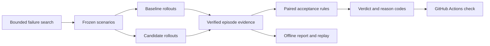

# Autonomous Driving Validation Lab

A reproducible simulation test platform that discovers driving failures, replays them, and rejects behavioral regressions in GitHub Actions.

The project extends the original PPO/SAC framework. **Measured claims concern the CPU kinematic simulator and synthetic state/range measurements.** Live CARLA and hardware behavior remain unverified.

Version 5's original untouched suite completed **249/256 missions (97.3%)**, versus **132/256 (51.6%)** for Stanley, with slower control under sensing faults. During the second review, version 6 completed **254/256** on that now-consumed regression suite, with zero collisions and two timeouts. The second review's fresh qualification and release blockers are recorded separately in [the review](docs/SECOND_REVIEW.md). All failed outcomes remain in the reports.


## Capabilities

- Frozen seeded nominal, geometry, sensing and actuator scenarios.
- Paired baseline/candidate evaluation with explicit `PASS`/`FAIL` reason codes.
- Immutable evidence with full trajectories, controller/model checksums, source/runtime provenance and integrity verification.
- Bounded steering-fault search, local amplitude reduction and exact replay checks.
- Portable offline reports and interactive timeline replays.
- Negative controls: reversed steering, speeding and permanent braking must fail; restoration must pass.
- Three-seed PPO experiments, including rejected outcomes.


```mermaid
flowchart LR
    S[Frozen scenarios] --> A[Baseline rollouts]
    S --> B[Candidate rollouts]
    A --> E[Verified episode evidence]
    B --> E
    E --> G[Paired acceptance rules]
    G --> V[Verdict and reason codes]
    E --> R[Offline report and replay]
    F[Bounded failure search] --> S
    V --> C[GitHub Actions check]
```

## Run the CPU project

Python 3.10+; the behavioral workflow uses Python 3.11. This path needs no GPU, CARLA, PyTorch or trained checkpoint.

```bash
python -m venv .venv
source .venv/bin/activate
pip install -r requirements-validation.txt
export PYTHONPATH=src
python scripts/validate_release.py --out artifacts/demo
```

On Windows PowerShell, activate with `.\.venv\Scripts\Activate.ps1` and set `$env:PYTHONPATH='src'` instead. Open `artifacts/demo/report.html` and `artifacts/demo/failure-replay.html`. `proof.json` contains the machine-checkable checks. Use a new output directory for each run; evidence is never silently replaced.

```bash
python -m ad_rl.validation.cli run --suite configs/validation/development-v1.json \
  --policy stanley --out artifacts/baseline
python -m ad_rl.validation.cli run --suite configs/validation/development-v1.json \
  --policy robust --out artifacts/candidate
python -m ad_rl.validation.cli compare --baseline artifacts/baseline/run.json \
  --candidate artifacts/candidate/run.json --rules configs/validation/gate-rules.json \
  --out artifacts/comparison
python -m ad_rl.validation.cli search --policy stanley --budget 64 --out artifacts/search
python -m ad_rl.validation.cli replay --run artifacts/demo/mutant-steering/run.json \
  --scenario nominal-000 --out artifacts/replayed
python -m ad_rl.validation.cli readiness --run artifacts/candidate/run.json \
  --out artifacts/release-readiness
```

`compare` exits **0** for a passing contract, **1** for a behavioral failure and **2** for invalid/incomparable evidence. `PASS` is a finite test-contract result, not a hardware safety claim.

`readiness` independently requires at least 32 cases in each of the four regimes, zero failed missions, and peak speed no more than 3 km/h above the target. It exits **0** when those simulation requirements are met, **1** when blocked, and **2** for invalid evidence. Reports show regression and release results separately. Older evidence without peak-speed measurements cannot satisfy release requirements. No simulation result authorizes hardware deployment.

## Evidence and results

See [measured results](docs/VALIDATION_RESULTS.md), [evidence design](docs/VALIDATION_DESIGN.md), [interview guide](docs/INTERVIEW_GUIDE.md) and [retained experiments](results/validation/).

Once a held-out suite has informed a controller change, it becomes regression data. Failed first evaluations are retained. Acceptance rules remain fixed: no new collisions, lane departures or failed missions; bounded route/lateral regressions; a nominal success floor; and an overspeed limit.

`robust` combines a nominal Stanley controller, delayed-state prediction, speed adaptation, local obstacle handling, nearby mapped range/lane fusion and an approximate steering/braking prediction filter. Interventions are logged. Controller inputs exclude scoring pose, success, collision and true clearance. Range measurements and mapped obstacle coordinates are ideal in these suites. Learned policies use the original ten-value state vector without range detections: comparisons are system comparisons, not equal-input algorithm superiority claims.

The default is now version 6, which filters nominal-road actions as well as disturbed sensing/geometry actions and retains bounded command history. `robust-v5` preserves the previously delivered controller for direct comparisons. Evaluation refuses to publish a completed run if package source changes during execution. Replay checks the recorded source and runtime before execution.

## GitHub Actions

[Behavioral validation](.github/workflows/behavioral-validation.yml) runs pinned CPU checks, paired scenarios, negative controls, restoration and replay proof, retaining artifacts on failure. [CI](.github/workflows/ci.yml) runs lint, formatting, blocking type checks, Python 3.10/3.11/3.12 tests, coverage and neural smoke integration. Branch protection must separately require these checks to prevent merging failures.

## Optional model experiments

```bash
pip install -e '.[dev,viz]'
python -m ad_rl.training.train --config configs/ppo_validation.yaml \
  --env fallback --obs state --run-name ppo_experiment --no-progress
python -m ad_rl.validation.cli run --suite configs/validation/development-v1.json \
  --policy model --model runs/ppo_experiment/final_model.zip --out artifacts/ppo-evaluation
```

Training saves resolved CLI overrides, actual timesteps, model checksum and source/runtime provenance. Per-run summaries preserve unrelated results. CARLA training requires a separate evaluation server (`--carla-eval-port`, default 2001 versus training port 2000); camera frames are synchronized and missing frames time out. Event callbacks remain asynchronous and live execution is unverified.

## Scope

Procedural single-lane roads, a point vehicle with kinematic bicycle dynamics, static circular obstacle checks and finite physics steps. No current claim covers traffic interaction, pedestrians, tire dynamics, real perception, continuous collision guarantees or hardware transfer. CARLA traffic-count settings do not currently spawn traffic.

[Historical documentation](docs/LEGACY_FRAMEWORK.md) is preserved. Earlier image-based result claims are superseded: historical saved metrics were state-based fallback evaluations.
