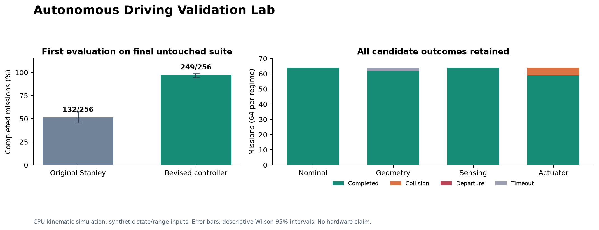

# Measured validation results

Recorded 4 October 2026. Primary evaluation: `configs/validation/held-out-v5.json`, generator seed 2236067, 64 cases per regime, 256 paired cases. The controller was frozen before its first evaluation. No threshold or control change followed these results.

## Final untouched evaluation

| Metric | Original Stanley | Revised controller |
|---|---:|---:|
| Completed missions | 132/256 (51.6%) | 249/256 (97.3%) |
| Collisions | 60 | 5 |
| Lane departures | 64 | 0 |
| Timeouts | 0 | 2 |
| Mean route completion | 63.5% | 98.0% |
| Mean speed | 29.44 km/h | 21.99 km/h |

The completion improvement is 45.7 percentage points. Collision count decreased 91.7%. The candidate deliberately slows during delayed sensing and obstacle handling; performance is not a same-speed comparison. Its existing actuator-fault collisions remain failures in the report.

| Regime | Baseline completed | Candidate completed | Candidate collisions | Departures | Timeouts |
|---|---:|---:|---:|---:|---:|
| Nominal | 64/64 | 64/64 | 0 | 0 | 0 |
| Geometry | 9/64 | 62/64 | 0 | 0 | 2 |
| Sensing | 0/64 | 64/64 | 0 | 0 | 0 |
| Actuator | 59/64 | 59/64 | 5 | 0 | 0 |

The final contract passed: no new collisions, departures or failed missions relative to the paired baseline; other versioned thresholds also passed. A passing relative contract permits existing baseline failures. This is not an absolute safety or deployment verdict. The seven failed missions are listed in `results/validation/final-held-out/summary.json`.

The aggregate success Wilson 95% interval is 94.46% to 98.67%. The interval is descriptive over this finite mixture of scenarios; it does not estimate road-vehicle reliability. Route difference uncertainty uses paired stratified bootstrap samples with fixed regime weights.

## Development and failure history

The final controller completed 32/32 development cases versus 16/32 for the baseline. Three intentional behavioral bugs were rejected; restoring the reference controller passed. Recorded failures replayed exactly on the pinned execution runtime.

Earlier first held-out evaluations in `first-held-out`, `second-held-out`, `third-held-out`, and `fourth-held-out` were rejected despite aggregate gains. New collision/departure cases were retained, consumed suites became regression data, and a fresh suite was generated after each substantive control revision. Those earlier evaluations are not independent final validation successes. The generator version is v1; the numbered filenames identify sequential frozen evaluation sets.

## Learned-policy experiment

An initial 200,704-step state-based PPO run completed its 10-episode ordinary-road evaluation but averaged 41.23 km/h against a 30 km/h target. The behavior gate rejected its speeding. This motivated a stronger speed-penalty experiment with three independent training seeds, each requested for 200,000 steps:

| Training seed | Actual steps | Development completion | Mean speed (km/h) | Gate |
|---|---:|---:|---:|---|
| 17 | 200,704 | 37.5% | 30.16 | FAIL |
| 29 | 200,704 | 56.2% | 33.42 | FAIL |
| 43 | 200,704 | 53.1% | 30.32 | PASS |

All seeds are retained in `ppo-speed-penalty/experiment.json`. These policies trained on ordinary fallback roads and use the ten-value state vector; the revised controller additionally consumes ideal local range/map measurements. These are system comparisons, not equal-input claims that classical control beats learning. The small experiment does not establish algorithm-wide conclusions.

## Verification and limits

- 72 full tests passed, including PPO/SAC smoke training and a training-provenance CLI test.
- Test coverage: 86.9% (branch measurement enabled); lint, formatting and blocking type checks passed.
- The small pinned CPU environment passed all 35 behavioral/sensor/filter tests.
- Complete final run/episode evidence passed integrity checks, and its source fingerprint matches the delivered package.
- Actual candidate collision replay and deliberately reversed-steering replay were checked on the pinned runtime.
- Live CARLA execution, real cameras, physical vehicles, independent range sensor faults and hardware transfer were not tested.

Full final artifacts are generated by `scripts/validate_release.py --suite configs/validation/held-out-v5.json --out artifacts/new-final-run`. Each run uses a new directory. CPU validation uses the versions in `requirements-validation.txt`; training versions and model identities are recorded in each experiment's provenance.
