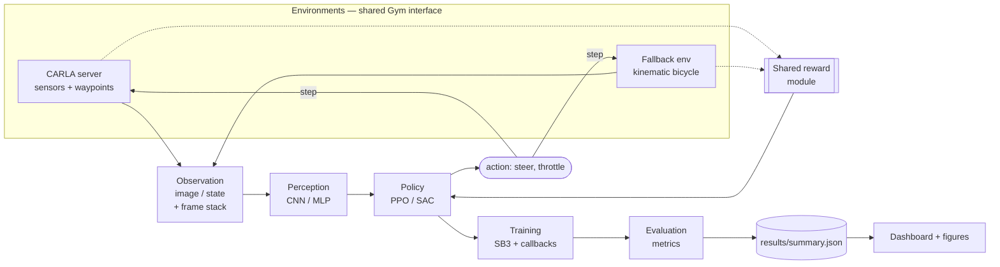

# Architecture & Design

This document explains how the codebase is organised and *why*. The guiding
principle is a **backend-agnostic Gymnasium interface**: everything above the
environment boundary (perception, agents, training, evaluation) is written once
and works identically against CARLA and the fast fallback environment.

## Data flow

## The environment contract

Both `CarlaEnv` and `KinematicDrivingEnv` implement the same contract:

- **Action space**: `Box(-1, 1, shape=(2,))` = `[steer, throttle_brake]`. A
  positive `throttle_brake` is throttle, negative is brake. Positive `steer`
  turns left (increases yaw).
- **Observation space**:
  - `image`: `Box(0, 255, (H, W, 3), uint8)` — a front camera (CARLA) or
    ego-centric top-down render (fallback). Frame stacking yields `(H, W, 3·n)`.
  - `state`: `Box(shape=(5 + K,))` — `[speed, lateral_error, sin(heading_err),
    cos(heading_err), prev_steer, …K curvature look-aheads]`.
- **Step `info`**: every step returns `speed_ms`, `lateral_error_m`,
  `heading_error_rad`, `route_fraction`, `collision`, `offroad`, `is_success`,
  and the decomposed `reward_components`. This is the glue that lets the *same*
  classical controller and the *same* metrics code work on both backends.

### Why a fallback environment?

| Concern | With CARLA only | With the fallback |
|---|---|---|
| Unit tests / CI | Impossible (no GPU, multi-GB) | Runs in seconds |
| Reward tuning | Minutes per iteration | Milliseconds |
| Onboarding | Download + GPU + setup | `pip install -e .` |
| Pipeline validation | Manual | Automated end-to-end |

The fallback is **not** a toy afterthought — it is the development substrate.
CARLA is the deployment target.

## Reward design

`compute_reward(measurement, cfg)` takes a backend-agnostic `DriveMeasurement`
and returns a scalar plus a per-term breakdown. Terminal events (collision,
off-road) short-circuit shaping with a dominant penalty so the learning signal
is unambiguous. Weights live in `configs/env.yaml` and are shared by both envs.

Keeping the reward in exactly one place is deliberate: duplicated reward logic
across a sim and a surrogate is a classic source of silent train/eval skew.

## Perception

`src/ad_rl/perception/cnn_extractor.py` provides two SB3 `BaseFeaturesExtractor`
implementations:

- **DrivingCNN** — the 3-layer NatureCNN (Mnih et al., 2015). Cheap, strong default.
- **ImpalaCNN** — residual conv stack (Espeholt et al., 2018), better visual
  generalisation at higher compute cost.

Observations arrive already scaled to `[0, 1]` by SB3's image preprocessing, so
the extractors do not re-normalise. `agents/_common.resolve_policy` selects
`CnnPolicy` + extractor for image obs and `MlpPolicy` for state obs.

## Agents & training

`agents/ppo.py` and `agents/sac.py` are thin, well-typed factories that map the
typed `Config` onto SB3 `PPO`/`SAC`. `training/train.py` is the CLI: it builds
vectorised envs, attaches callbacks (`EvalCallback`, `CheckpointCallback`, and a
custom `RewardComponentsCallback` that logs each reward term), trains, saves the
best/final model, then runs a deterministic final evaluation that writes
`results/summary.json`.

Frame stacking is applied as a **Gym wrapper inside `make_env`** (not SB3's
`VecFrameStack`) so that training and evaluation construct byte-identical
observation pipelines — a policy is evaluated exactly as it was trained.

## Evaluation

`evaluation/evaluate.py` rolls out any policy — a trained PPO/SAC model *or* a
PID/Stanley baseline — through the same loop and computes AV-relevant metrics in
`evaluation/metrics.py`: success rate, route completion, collision/off-road
rates, mean lateral error, steering jerk (comfort), and speed. Results merge
into a versioned `summary.json` consumed by the dashboard and figure scripts.

## Configuration

`utils/config.py` loads hierarchical YAML (`defaults: env.yaml`) into frozen-ish
dataclasses (`EnvConfig`, `RewardConfig`, `CarlaConfig`, `FallbackConfig`),
giving the whole codebase autocomplete and type-checking instead of
stringly-typed dict access. CLI flags override any field.

## Testing strategy

- **Pure-logic tests** (config, reward, control, metrics, env, wrappers,
  evaluation) need only NumPy + Gymnasium and run everywhere.
- **`importorskip`-guarded tests** (perception forward pass, PPO/SAC smoke
  training) run wherever PyTorch / Stable-Baselines3 are installed — i.e. in CI
  and on a dev machine — and are skipped gracefully otherwise.

This split keeps the fast feedback loop fast while still proving the deep-RL
path actually trains in CI.
